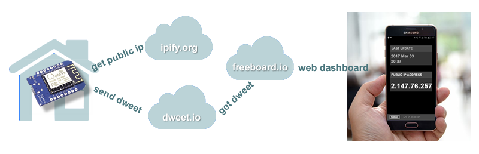
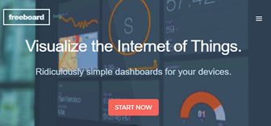

# CloudMyIp
*Know your router public IP address, from anywhere. Great for cheap routers or IP cameras. Free.*

**CloudMyIp** is an inexpensive ($3) IOT device that _reads_ the public IP address assigned to your router by your ISP (Internet Service Provider), and _publishes_ it on a web page anyone can read with a link. 
Great for accessing your home network or IP cameras from abroad, saving the money for a subscription to a dynamic dns service (or the time spent for similar "free" services requiring you to connect and read their ads once a month for continued service).



## How it works:
* an ESP8266 module (e.g. NodeMCU) reads the home network public IP address using the [ipify.org](http://ipify.org) API
* the module echoes back the public IP address to the cloud, publishing a "dweet" using the [dweet.io](http://dweet.io) APIs.
* a web application running on [freeboard.io](http://freeboard.io) reads the dweet, and presents the public IP address nicely  using any web browser. 

## Dweets?
Dweet are Tweets for devices. A device (in our case, the ESP8266) can "dweet" a short message on [__dweet.io__](https://dweet.io). For up to the next 24 hours, anyone can read it pointing his browser to the dweet thing name. If you haven't tried a dweet before, try typing this URL on your browser (or at least just click the link if you are damn lazy):
> <http://dweet.io/dweet/for/yourDweetThingName?hello=world>

This is all it takes to send a dweet to the Cloud.
Now try to read it:
> <http://dweet.io/get/latest/dweet/for/yourDweetThingName>

Is that simple. Don't even need to register :-)

## Visualize dweets on a dashboard
Dweets are great, but reading them typing a long URL in a browser is annoying. [__Freeboard__](https://freeboard.io) makes it simple showing dweets on a nice web dashboard in just few clicks. A free account is all you need. Pages created this way can be read by anyone with the link, and can also be loaded as web apps on your phone desktop, making access super-easy (choose "Add to home screen" on Android).



## Steps to set up your system
### 1. Start from the Arduino sketch.
Replace the following lines with your WiFi network name and password, and yourDweetThingName with something unique to identify your dweets among others (as dweets are public and shared, try to be unique but not too personal). Never insert spaces or special characters here.
```c++
const char* ssid = "yourWifi";
const char* password = "yourPassword";
String dweetThingName("yourDweetThingName");
```
Compile and program your 'duino. Verify on the serial monitor that the board is actually connecting to the WiFi and reporting the IP address. Now you can read the dweets browsing to  <http://dweet.io/get/latest/dweet/for/yourDweetThingName> (crude) or continue setting up a nice and easy dashbord to display it automatically.

### 2. Setup a dashboard for showing the IP.
Register on [__freeboard.io__](https://freeboard.io) and login (please have a look at the tutorial). The next step are easier to follow from a video, I've put one here: [__Freeboard setup video on youTube__](https://youtu.be/QreTYtv3lsc). Just be careful to match the "THING NAME" (AlbertoHomeRouter in the video) to what you set as dweetThingName in the Arduino sketch.

### 3. Share the link
Freeboard's "SHARE" button shows a link anyone can use to view your dashboard. In addition, if your browser supports web-applications, you can also create an icon to access it directly like any other app (on the Android browser this is done selecting "Add to home screen" from the "Other" menu).


